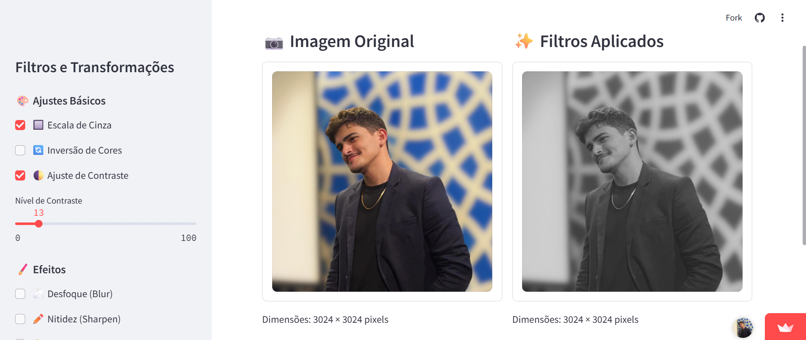
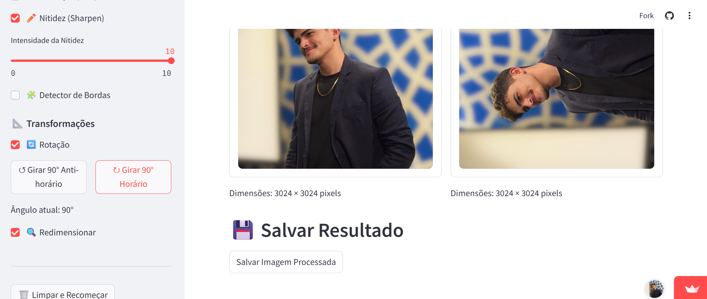

# Visualizador de Imagens com Filtros

## 🎬 [Acesse o vídeo explicativo clicando aqui](link) 

<div style="text-align: center; width: 500px; margin: 0 auto;">
    <h3>Figura 1: Imagem geral da Aplicação</h3>
    <div style="max-width: 500px; margin: 0 auto;">
        
    </div>
    <p><em>Fonte: Produzida pelo Autor (2025).</em></p>
</div>

## 📷 Visão Geral

Este projeto consiste em um aplicativo web interativo que permite ao usuário carregar, visualizar, processar e salvar imagens aplicando diversos filtros e transformações. Desenvolvido como parte da atividade avaliativa do módulo 06 do curso de Engenharia da Computação, o aplicativo atende a todos os requisitos especificados, implementando uma interface amigável e intuitiva que exibe a imagem original e a processada lado a lado.

<div style="text-align: center; width: 500px; margin: 0 auto;">
    <h3>Figura 2: Aplique de editores de imagem</h3>
    <div style="max-width: 500px; margin: 0 auto;">
        
    </div>
    <p><em>Fonte: Produzida pelo Autor (2025).</em></p>
</div>

### 🎨 Demonstração da Aplicação

O aplicativo está disponível online através do Streamlit Cloud: [Link para o aplicativo](https://zzaved-visualizador-de-imagens-app-lxzkqc.streamlit.app/)

## 💻 Funcionalidades

### 📊 Filtros Implementados

* **Escala de cinza**: Converte a imagem para tons de cinza
* **Inversão de cores**: Inverte todas as cores da imagem
* **Ajuste de contraste**: Permite modificar o nível de contraste (0-100%)
* **Desfoque (Blur)**: Aplica um efeito de desfoque com controle de intensidade
* **Nitidez (Sharpen)**: Aumenta a nitidez da imagem com controle de intensidade
* **Detector de bordas**: Identifica e destaca os contornos dos objetos na imagem

### 🔄 Transformações

* **Rotação**: Permite girar a imagem em incrementos de 90° (horário e anti-horário)
* **Redimensionamento**: Modifica o tamanho da imagem com exibição das dimensões original e nova

### 🛠️ Recursos Adicionais

* **Upload de imagem**: Suporte para formatos JPG, JPEG e PNG
* **Exibição lado a lado**: Visualização simultânea da imagem original e processada
* **Informações de dimensões**: Exibe o tamanho em pixels de ambas as imagens
* **Download da imagem processada**: Salva a imagem com todos os filtros aplicados
* **Interface responsiva**: Layout organizado que se adapta a diferentes tamanhos de tela
* **Estado persistente**: Mantém os filtros aplicados durante a sessão

## 🚀 Tecnologias Utilizadas

* **Python**: Linguagem de programação principal
* **Streamlit**: Framework para criação da interface gráfica web
* **Pillow (PIL)**: Biblioteca para processamento de imagens
* **NumPy**: Biblioteca para manipulação de arrays numéricos

## 📋 Requisitos

* Python 3.7 ou superior
* Bibliotecas listadas em `requirements.txt`

## ⚙️ Instalação e Execução

### Preparação do Ambiente

1. Clone este repositório:
```bash
git clone https://https://github.com/zzaved/Visualizador-de-Imagens
cd Visualizador-de-imagens
```

2. Instale as dependências:
```bash
pip install -r requirements.txt
```

### Execução Local

Execute o aplicativo com:
```bash
streamlit run app.py
```

O aplicativo será aberto em seu navegador padrão, geralmente em http://localhost:8501.

## 📚 Estrutura do Projeto

```
visualizador-de-imagens/
├── app.py                 # Aplicativo principal com a interface Streamlit
├── image_processor.py     # Módulo com as funções de processamento de imagem
├── requirements.txt       # Dependências do projeto
└── README.md              # Documentação
```

### 📁 Detalhes dos Arquivos

* **app.py**: Contém a interface do usuário e a lógica principal de interação
* **image_processor.py**: Implementa todas as funções de processamento e transformação de imagens
* **requirements.txt**: Lista todas as bibliotecas necessárias para executar o projeto

## 🔍 Padrões de Qualidade do Código

### 📐 Organização e Modularidade

O código foi estruturado seguindo princípios de design modular:
* Separação clara entre interface (app.py) e processamento (image_processor.py)
* Funções bem definidas com responsabilidade única
* Documentação detalhada com docstrings para cada função
* Comentários explicativos em seções importantes do código

### 🔧 Tratamento de Erros

O aplicativo implementa tratamento de erros para garantir robustez:
* Validação do formato da imagem carregada
* Tratamento de casos onde filtros não podem ser aplicados
* Feedback visual para o usuário em caso de erros

### 🎯 Boas Práticas

* Uso de tipos de dados adequados
* Nomes de variáveis descritivos e consistentes
* Organização lógica do fluxo de processamento
* Código limpo e legível com formatação consistente
* Utilização adequada das estruturas de dados

## 👨‍💻 Autor

Desenvolvido por [Pablo Azevedo](https://github.com/zzaved)